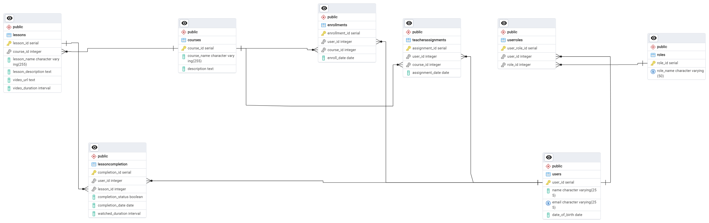

# Project Solutions Overview

This project contains solutions organized by sections. Below is the guide to locate the solutions for each section:

## ER Diagram

Below is the ER diagram for the database structure for Section 1:

- **Section 1**: The solution can be found in the respective folder for this section.

- **Section 2**: Since the last two sections are smaller, they have been merged with Section 2. You can find the solution for Section 2 in:`section-2/lms_project/courses/`.
 
- **Section 3**: The solution for Section 3 is merged with Section 2 and can be found in the following file: `section-2/lms_project/courses/section_3.py`
 
- **Section 4**: The solution for Section 4 is also merged into Section 2 and is located in the frontend folder: `section-2/frontend`

